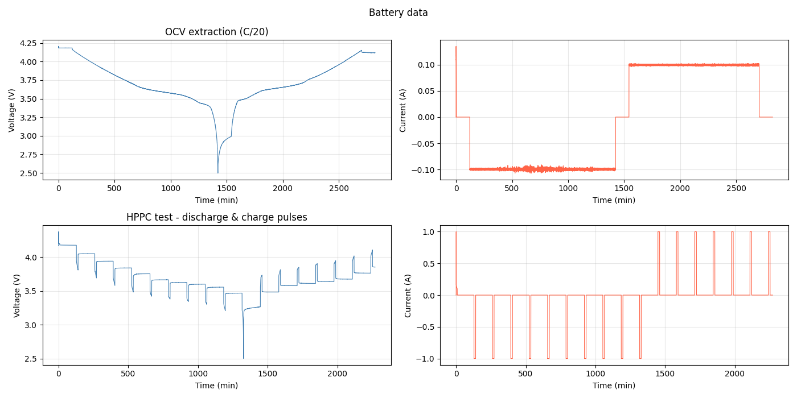

# 🔋 Battery Model & SOC Estimation

## What is a Battery Model

A battery model is a set of mathematical equations that describes how a battery 
behaves electrically, how its voltage responds to current, how it stores and 
releases charge, and how its internal resistance affects performance. It takes 
measurable inputs (voltagecurrent, temperature) and produces predictions of internal 
states such as state of charge (SOC) and state of health (SOH) that cannot be measured directly.

## Why a Battery Model is Necessary

A battery does not have a direct way to measure its state. You cannot attach a 
sensor to read SOC or SOH the way you would read temperature or voltage. The only 
quantities measurable in real time are **terminal voltage**, **current**, and 
**temperature**. Everything else must be estimated.

This is where the battery model becomes essential. The model acts as a mathematical 
representation of the battery's internal behaviour, allowing the firmware to infer 
hidden states from the measurable signals. Without a model, the firmware has no way 
to interpret what the voltage and current measurements actually mean in terms of 
remaining charge, health, or available power.

In the **OpenBMS firmware** the battery model serves as the core engine for 
estimating:

- **SOC (State of Charge)** — how much charge remains, expressed as a percentage
  of full capacity. Critical for fuel gauge accuracy and preventing over-discharge.

- **SOH (State of Health)** — how much the cell has degraded relative to its 
  original capacity and resistance. Used to predict end-of-life and adjust SOC 
  calculations as the cell ages.

- **SOP (State of Power)** — the maximum current the cell can deliver or accept 
  at the current moment without violating voltage limits. Used for power management 
  and protection.

- **Terminal voltage prediction** — the model predicts what voltage the cell should 
  show under a given load. The difference between predicted and measured voltage is 
  the correction signal that drives the Kalman filter.

## Battery Modelling Overview

Rechargeable batteries can be modelled at different levels of complexity depending 
on the application. The main approaches are:

- **Electrochemical models** — describe the internal physics and chemistry in detail
  (e.g. Doyle-Fuller-Newman model). Very accurate but computationally expensive.
  Used mainly in research and cell design.

- **Mathematical/empirical models** — use fitted equations to describe capacity fade
  and voltage behaviour. Simple but limited in dynamic accuracy.

- **Equivalent Circuit Models (ECM)** — represent the battery using standard
  electrical components (resistors, capacitors, voltage sources). Good balance
  between accuracy and computational cost. Widely used in BMS applications.

This project uses the **2RC Thevenin Equivalent Circuit Model** — the industry 
standard for battery management systems. It captures the two dominant dynamic 
processes inside the cell (fast charge-transfer kinetics and slow solid-state 
diffusion) with enough accuracy for real-time SOC estimation on embedded hardware.

 

### Model Parameters

The model requires the following parameters:

| Parameter | Description | Unit |
|---|---|---|
| **V_OCV** | Open Circuit Voltage — equilibrium voltage with no current flowing | V |
| **R0** | Ohmic resistance — instantaneous voltage drop, includes contact and SEI resistance | Ω |
| **R1** | Polarization resistance of first RC pair — models fast charge-transfer kinetics | Ω |
| **τ1** | Time constant of first RC pair (τ1 = R1·C1) — typically 5 to 100 seconds | s |
| **R2** | Polarization resistance of second RC pair — models slow solid-state diffusion | Ω |
| **τ2** | Time constant of second RC pair (τ2 = R2·C2) — typically 100 to 1000 seconds | s |
| **Q_nom** | Nominal cell capacity — total charge the cell can deliver | Ah |

Note that C1 and C2 are not stored directly — they are always derived from 
τ and R as C = τ / R.

### Parameter Extraction

There are several methods to extract battery model parameters, each with different 
trade-offs between accuracy, equipment requirements, and complexity. In this firmware, parameters are extracted offline using two complementary tests:

- **C/20 low-current OCV test** — a very slow full discharge followed by a full 
  charge at C/20 rate. Used to extract the **V_OCV vs SOC curve** in both 
  directions and measure **Q_nom**. The slow rate minimizes polarization so the 
  measured voltage closely approximates the true open circuit voltage.

- **HPPC test** — current pulses at fixed SOC setpoints across the full SOC range 
  in both discharge and charge directions. Used to extract **R0, R1, τ1, R2, τ2** 
  at each SOC point. The instantaneous voltage drop gives R0 and the relaxation 
  curve after each pulse is fitted using Prony's method to extract the RC parameters.

The extracted parameters are stored as lookup tables indexed by SOC and current 
direction, covering the full range from 2% to 100% SOC. At runtime the firmware 
interpolates between table entries to get the parameter values at the current 
operating point.

 

### Additional Battery Parameters

Beyond the core ECM parameters, the following additional characteristics are 
required for a complete and accurate battery model:

| Parameter | Description | Unit |
|---|---|---|
| **η (Coulombic efficiency)** | Ratio of discharge to charge capacity — typically 0.995 to 0.999 for healthy Li-ion | — |
| **OCV hysteresis** | Difference between charge and discharge OCV curves at the same SOC — 5 to 30 mV depending on chemistry | V |
| **Q_nom(T)** | Capacity derating with temperature — usable capacity drops significantly below 10°C | Ah |
| **Self-discharge rate** | Charge lost with no load connected — 1 to 5% per month at 25°C depending on chemistry | % / month |

