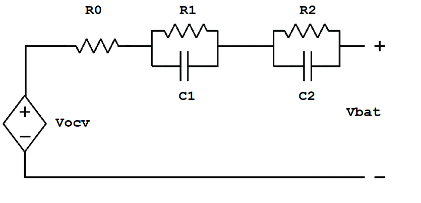
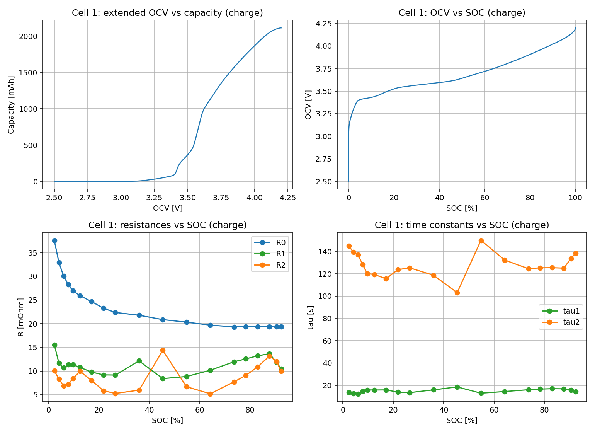
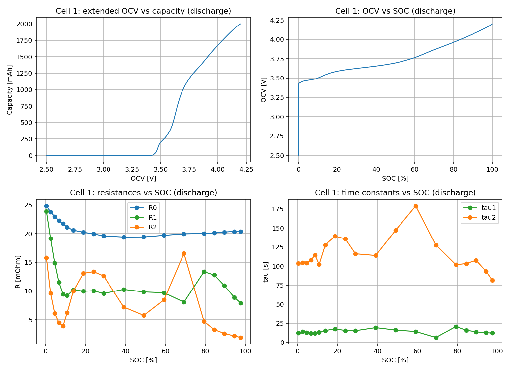
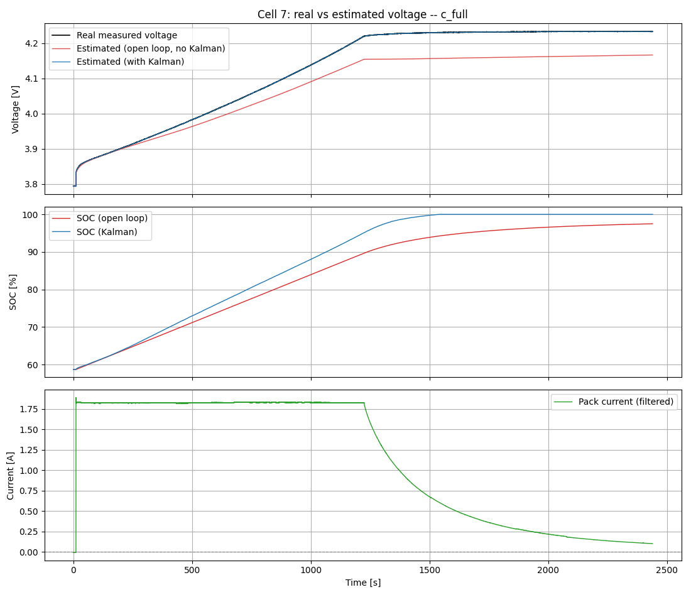
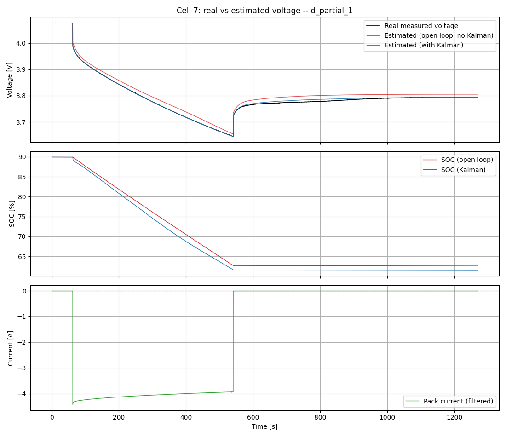

# 🔋 Battery Model & SOC Estimation

## What is a Battery Model

A battery model is a set of mathematical equations that describes how a battery 
behaves electrically, how its voltage responds to current, how it stores and 
releases charge, and how its internal resistance affects performance. It takes 
measurable inputs (voltagecurrent, temperature) and produces predictions of internal 
states such as state of charge (SOC) and state of health (SOH) that cannot be measured directly.

## Why a Battery Model is Necessary

A battery does not have a direct way to measure its state. You cannot attach a 
sensor to read SOC or SOH the way you would read temperature or voltage. The only 
quantities measurable in real time are **terminal voltage**, **current**, and 
**temperature**. Everything else must be estimated.

This is where the battery model becomes essential. The model acts as a mathematical 
representation of the battery's internal behaviour, allowing the firmware to infer 
hidden states from the measurable signals. Without a model, the firmware has no way 
to interpret what the voltage and current measurements actually mean in terms of 
remaining charge, health, or available power.

In the **OpenBMS firmware** the battery model serves as the core engine for 
estimating:

- **SOC (State of Charge)** — how much charge remains, expressed as a percentage
  of full capacity. Critical for fuel gauge accuracy and preventing over-discharge.

- **SOH (State of Health)** — how much the cell has degraded relative to its 
  original capacity and resistance. Used to predict end-of-life and adjust SOC 
  calculations as the cell ages.

- **SOP (State of Power)** — the maximum current the cell can deliver or accept 
  at the current moment without violating voltage limits. Used for power management 
  and protection.

- **Terminal voltage prediction** — the model predicts what voltage the cell should 
  show under a given load. The difference between predicted and measured voltage is 
  the correction signal that drives the Kalman filter.

## Battery Modelling Overview

Rechargeable batteries can be modelled at different levels of complexity depending 
on the application. The main approaches are:

- **Electrochemical models** — describe the internal physics and chemistry in detail
  (e.g. Doyle-Fuller-Newman model). Very accurate but computationally expensive.
  Used mainly in research and cell design.

- **Mathematical/empirical models** — use fitted equations to describe capacity fade
  and voltage behaviour. Simple but limited in dynamic accuracy.

- **Equivalent Circuit Models (ECM)** — represent the battery using standard
  electrical components (resistors, capacitors, voltage sources). Good balance
  between accuracy and computational cost. Widely used in BMS applications.

This project uses the **2RC Thevenin Equivalent Circuit Model** — the industry 
standard for battery management systems. It captures the two dominant dynamic 
processes inside the cell (fast charge-transfer kinetics and slow solid-state 
diffusion) with enough accuracy for real-time SOC estimation on embedded hardware.

 

### Model Parameters

The model requires the following parameters:

| Parameter | Description | Unit |
|---|---|---|
| **V_OCV** | Open Circuit Voltage — equilibrium voltage with no current flowing | V |
| **R0** | Ohmic resistance — instantaneous voltage drop, includes contact and SEI resistance | Ω |
| **R1** | Polarization resistance of first RC pair — models fast charge-transfer kinetics | Ω |
| **τ1** | Time constant of first RC pair (τ1 = R1·C1) — typically 5 to 100 seconds | s |
| **R2** | Polarization resistance of second RC pair — models slow solid-state diffusion | Ω |
| **τ2** | Time constant of second RC pair (τ2 = R2·C2) — typically 100 to 1000 seconds | s |
| **Q_nom** | Nominal cell capacity — total charge the cell can deliver | Ah |

Note that C1 and C2 are not stored directly — they are always derived from 
τ and R as C = τ / R.

### Parameter Extraction

There are several methods to extract battery model parameters, each with different 
trade-offs between accuracy, equipment requirements, and complexity. In this firmware, parameters are extracted offline using **Hybrid Pulse Power Characterization Test**.

**HPPC test** — current pulses at fixed SOC setpoints across the full SOC range 
  in both discharge and charge directions. Used to extract **R0, R1, τ1, R2, τ2** 
  at each SOC point. The instantaneous voltage drop gives R0 and the relaxation 
  curve after each pulse is fitted using Prony's method to extract the RC parameters.

The extracted parameters are stored as lookup tables indexed by SOC and current 
direction, covering the full range from 2% to 100% SOC. At runtime the firmware 
interpolates between table entries to get the parameter values at the current 
operating point.

#### HPPC battery charging test:

#### HPPC battery discharging test:

### Additional Battery Parameters

Beyond the core ECM parameters, the following additional characteristics are 
required for a complete and accurate battery model:

| Parameter | Description | Unit |
|---|---|---|
| **η (Coulombic efficiency)** | Ratio of discharge to charge capacity — typically 0.995 to 0.999 for healthy Li-ion | — |
| **OCV hysteresis** | Difference between charge and discharge OCV curves at the same SOC — 5 to 30 mV depending on chemistry | V |
| **Q_nom(T)** | Capacity derating with temperature — usable capacity drops significantly below 10°C | Ah |
| **Self-discharge rate** | Charge lost with no load connected — 1 to 5% per month at 25°C depending on chemistry | % / month |

### Example of battery extracted parameters

The HPPC test is run separately in the charge and discharge directions because 
the extracted parameters are not the same — R0, R1, τ1, R2, and τ2 differ between 
charging and discharging at the same SOC due to the asymmetric electrochemical 
kinetics of the cell. For this reason the firmware stores and interpolates 
separate lookup tables for each direction rather than a single shared table.

#### Cell 1 extracted parameters - charging:

#### Cell 1 extracted parameters - discharging:

## SOC Estimation with an Extended Kalman Filter

The ECM and the parameter tables above describe how the battery behaves. They 
do not, by themselves, tell you the SOC — for that, the model has to be run 
forward against live current and voltage measurements. This section covers 
how that runs in practice.

### Why Not Just Integrate Current

The simplest possible SOC estimate is coulomb counting: start from a known 
SOC and integrate current over time, `SOC(t) = SOC(0) + ∫I·dt / Q_nom`. This 
works, but it has no way to correct itself. Current sensor offset, ADC 
quantization, and any error in `Q_nom` all integrate too, so the estimate 
drifts further from the truth the longer the pack runs with no way back. A 
pack that starts a long trip 2% off will still be 2% off — or worse — 
whenever it lands, unless something periodically checks the estimate against 
an independent signal.

The independent signal available here is voltage. The ECM predicts what 
voltage the cell should show for a given SOC and current; comparing that 
prediction against the cell's actual measured voltage gives a correction 
signal that coulomb counting alone can never produce. Combining the two — a 
model-based prediction and a real measurement — is exactly what a Kalman 
filter does.

### The Extended Kalman Filter

The filter's state is `[SOC, V_RC1, V_RC2]` — the charge level plus the 
voltage sitting across each RC branch from the model above. Every step runs 
in two halves:

- **Predict** — SOC advances by coulomb counting (current × Δt / `Q_nom`), 
  and V_RC1/V_RC2 decay or charge toward their steady-state values at the 
  rates set by `τ1`/`τ2` and `R1`/`R2` at the current SOC. This half needs 
  no measurement at all — it is the same open-loop prediction the ECM makes 
  on its own.

- **Correct** — the predicted state gives a predicted terminal voltage, 
  `V_OCV(SOC) + I·R0 + V_RC1 + V_RC2`. The gap between that prediction and 
  the cell's actual measured voltage is fed back through the OCV curve's 
  local slope (`dV_OCV/dSOC`) to nudge SOC, V_RC1 and V_RC2 toward whatever 
  values would have made the prediction match reality — weighted by how much 
  the filter trusts the model versus the measurement at that moment.

That weighting is what makes it a *Kalman* filter rather than a fixed 
correction rule: it tracks its own uncertainty about the state and about the 
measurement, and blends the two accordingly.

### Filter Tuning Parameters

| Parameter | Description | Register |
|---|---|---|
| **Q_SOC** | Process noise for the SOC state — how much the filter expects coulomb counting to drift per step | `KF_Q_SOC()` `0xA1` |
| **Q_RC1** | Process noise for V_RC1 — how much it expects the RC1 model to be off | `KF_Q_RC1()` `0xA2` |
| **Q_RC2** | Process noise for V_RC2 — how much it expects the RC2 model to be off | `KF_Q_RC2()` `0xA3` |
| **R_V** | Measurement noise — how much it trusts the voltage sensor itself | `KF_R_V()` `0xA4` |
| **P0** | Initial covariance — how uncertain the state is right after the seed, before any correction | *(script-side only; no firmware register)* |

Higher process noise (`Q_*`) makes the filter trust the model less and lean 
harder on the measurement; higher measurement noise (`R_V`) does the 
opposite. These are reasonable starting points rather than fitted values — 
there is no independent ground-truth SOC in a normal log to fit them 
against — and are tuned by hand against how the Kalman trace behaves 
compared to the open-loop trace.

### Guarding Against Bad Corrections

The correction step assumes any gap between predicted and measured voltage 
means the state estimate is wrong. That assumption breaks in two situations 
worth designing around explicitly. Right at a fast current step, a cell's 
voltage sensor can momentarily disagree with what its `R0` predicts by more 
than noise alone would explain — trusting that one sample fully can yank SOC 
by a physically implausible amount in a single step. And with no current 
flowing at all, coulomb counting says SOC cannot be changing, so any residual 
during rest can only be an imperfect `R1`/`R2`/`τ1`/`τ2` relaxation fit — 
never real charge — yet the correction step has no built-in way to know that 
unless it's told.

The estimator therefore checks each correction before applying it: whether 
the residual is statistically plausible given the filter's own uncertainty, 
whether it implies a rate of SOC change coulomb counting could never produce, 
and whether any current is actually flowing at all. A correction that fails 
these checks is scaled back or, at rest, blocked from touching SOC 
entirely — V_RC1 and V_RC2 are still free to absorb it, since a relaxation 
mismatch is exactly what they're there to represent.

### Example of SOC Estimation

Each run below replays a real log through the model twice — open loop (pure 
prediction, no correction) and with the Kalman filter — and plots both 
against the cell's actual measured voltage, the two SOC traces, and the pack 
current that drove them. The Kalman trace tracking the real voltage 
noticeably more closely than the open-loop trace is the filter doing its job; 
persistent daylight between them across a whole run is a sign the underlying 
parameter table, not the filter, needs a second look.

#### SOC estimation - charging:

#### SOC estimation - discharging:

