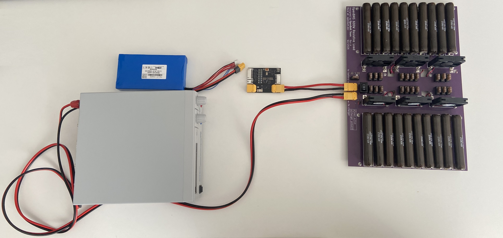

# 🚀 How to Use

A brief, end-to-end walkthrough: get the repo set up, flash the board, collect HPPC data, and turn it into a working SOC estimate. Each step links to the doc with the full detail — this page is just the path through them in order.

## 1. First-time setup

Clone the repo and install the [Prerequisites](README.md#prerequisites) from the main README (STM32CubeIDE for VS Code extension). Open the `firmware/` folder in VS Code through that extension so `CUBE_BUNDLE_PATH` and the CMake presets resolve correctly.

For the host-side tooling, install the Python dependencies:

```
pip install pyserial numpy pandas scipy matplotlib
```

Connect the board over USB and note which COM port it shows up on — every script below takes that as an argument.

## 2. Build and flash the firmware

Build the `firmware` project from VS Code (STM32CubeIDE extension) — this produces `firmware/build/Debug/openbms-firmware.hex`.

On a fresh board, flash the bootloader once using an STM32 SWD programmer (see the `bootloader/` project) — `flash.py` talks to the board over UART, and that only works once the bootloader is already on the chip. Then flash the firmware itself:

```
python python_scripts/flash.py <COM_PORT> firmware/build/Debug/openbms-firmware.hex
```

Sanity-check that the board is alive and its configuration looks right:

```
python python_scripts/read_all_registers.py <COM_PORT>
```

## 3. Collect HPPC data

This step runs on real hardware — the board, a battery pack, and a way to charge and discharge it (e.g. a charger plus a resistive test bench load). Example setup:



`battery_cycler.py` is the script that actually talks to the board to run a test. For parameter extraction you want the HPPC modes — they alternate rest periods with coulomb-counted current ramps through a checkpoint schedule, and take several hours per direction:

```
python python_scripts/battery_cycler.py CHPPC <COM_PORT>
python python_scripts/battery_cycler.py DHPPC <COM_PORT>
```

Each run writes a timestamped CSV log. The same script also has quicker modes (`M` monitor, `C`/`D` continuous charge/discharge, `CP`/`DP` pulsed) for everyday bench checks that don't need the full HPPC schedule — see [python-script.md](python-script.md#battery_cyclerpy) for all of them.

## 4. Extract HPPC parameters

Turn each HPPC log into per-cell OCV/R0/R1/τ1/R2/τ2 and capacity, run separately per direction:

```
python python_scripts/hppc_pipeline.py C <charge_hppc_log.csv>
python python_scripts/hppc_pipeline.py D <discharge_hppc_log.csv>
```

This writes `hppc_soc_table_all_cells_charge.csv` and `hppc_soc_table_all_cells_discharge.csv` into `python_scripts/results/`. See [battery-model.md](battery-model.md#example-of-battery-extracted-parameters) for what these parameters mean and why charge/discharge differ.

## 5. Build the Kalman filter tuning

Pair the HPPC-derived capacity with the filter's tuning constants:

```
python python_scripts/kalman_soc_estimator.py --charge-table python_scripts/results/hppc_soc_table_all_cells_charge.csv --discharge-table python_scripts/results/hppc_soc_table_all_cells_discharge.csv
```

This writes `kalman_parameters.csv`. See [battery-model.md](battery-model.md#filter-tuning-parameters) for what each constant tunes.

## 6. Preview the SOC estimate

Run the actual model against a real current/voltage log and watch it live — real vs. open-loop vs. Kalman-corrected voltage, SOC, and pack current, per cell:

```
python python_scripts/soc_estimator.py <log.csv>
```

It defaults to the `results/` files the previous two steps produced. Console output includes an RMSE table and flags any cell whose corrections are getting gated a lot — worth a second look on the hardware side if that happens. See [battery-model.md](battery-model.md#soc-estimation-with-an-extended-kalman-filter) for how the filter works.

## 7. Loading parameters onto the board (not ready yet)

None of the scripts above write the computed OCV/ECM tables or Kalman tuning constants back onto the device — today they only produce CSVs on your machine. Getting those values loaded into the fuel-gauge registers (`0x86`–`0xA4`, see [communication-protocol.md](communication-protocol.md#fuel-gauge-data--0x80--0xac)) will be handled by **OpenBMS Studio**, a dedicated app for this — but it's still in progress and not available yet.

## See also

- [python-script.md](python-script.md) — full reference for every script: inputs, outputs, flags.
- [battery-model.md](battery-model.md) — the battery model and Kalman filter theory behind these numbers.
- [communication-protocol.md](communication-protocol.md) — the wire protocol all of these scripts speak to the board.
